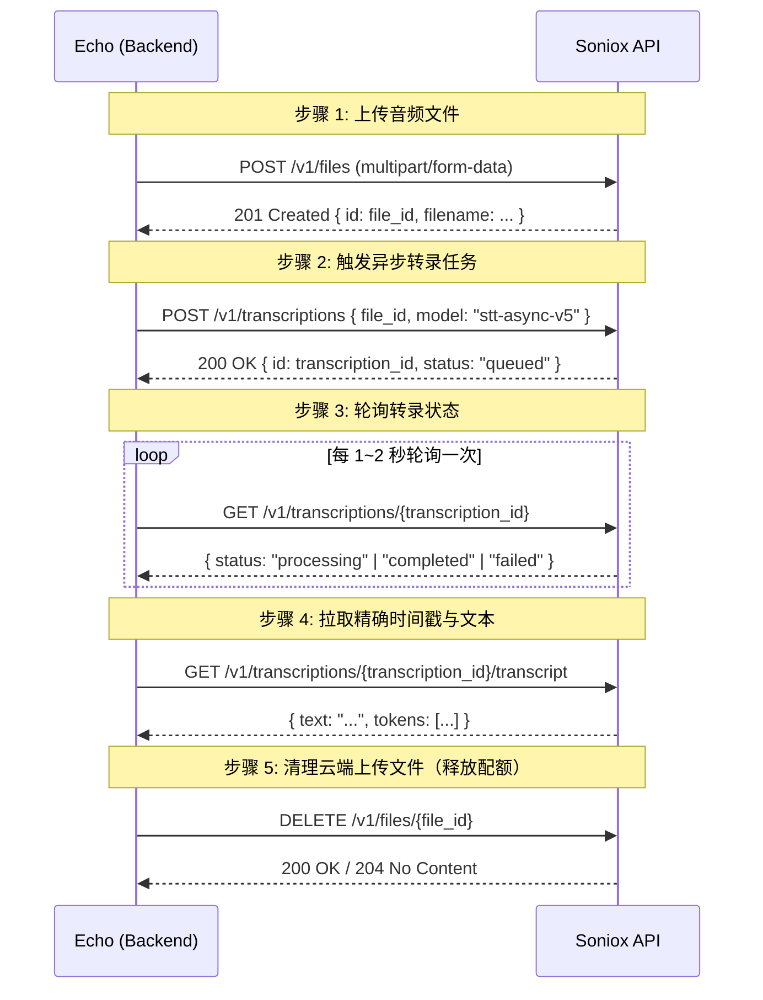

# Soniox 语音识别（STT / ASR）接入技术指南

本文档介绍如何在 Echo 语音助手架构中接入并使用 **Soniox** 高精度多语言语音识别服务。

---

## 1. 关于 Soniox

**Soniox** 是一家专注于端到端多语言语音人工智能（Speech AI）的技术公司。其核心优势包括：
- **超低字错误率（WER）**：在真实会议、嘈杂背景、多人交谈场景下具备优异的识别鲁棒性。
- **真正的字级时间戳（Word-level Timestamps）**：返回精确到毫秒级的 Token/Word 时间切片，天然适用于精准字幕（SRT/VTT）生成及词级高亮播放。
- **60+ 语言与无缝混合切换**：自动检测并转录多语种混说（如中英混杂商务会话）。
- **隐私保护与临时存储**：支持上传音频处理完成后即时删除，不留存用户隐私语音。

---

## 2. API 接口规格与调用生命周期

Soniox REST API 采用标准的 Bearer 鉴权，Base URL 为：
```http
https://api.soniox.com/v1
```

### 2.1 鉴权方式
所有请求均需要在 HTTP Header 中包含 API Key：
```http
Authorization: Bearer <SONIOX_API_KEY>
```

### 2.2 完整的转录调用流程



---

## 3. 请求与响应数据结构

### 3.1 文件上传
- **URL**: `POST https://api.soniox.com/v1/files`
- **Content-Type**: `multipart/form-data`
- **响应示例**:
```json
{
  "id": "file_8f29c17b_934d_47e2_8941_312cb84918e2",
  "filename": "meeting_audio.mp3",
  "size": 1048576,
  "created_at": "2026-09-07T15:30:00Z"
}
```

### 3.2 发起转录
- **URL**: `POST https://api.soniox.com/v1/transcriptions`
- **Headers**: `Content-Type: application/json`
- **请求体**:
```json
{
  "file_id": "file_8f29c17b_934d_47e2_8941_312cb84918e2",
  "model": "stt-async-v5"
}
```
- **响应示例**:
```json
{
  "id": "transcription_d4982a17_2839_4b1a_9c28_e891029c7821",
  "status": "queued",
  "created_at": "2026-09-07T15:30:01Z"
}
```

### 3.3 获取转录与字级时间戳
- **URL**: `GET https://api.soniox.com/v1/transcriptions/{id}/transcript`
- **响应示例**:
```json
{
  "id": "transcription_d4982a17_2839_4b1a_9c28_e891029c7821",
  "text": "Hello world this is a speech test",
  "tokens": [
    { "text": "Hello", "start_ms": 120, "end_ms": 480, "confidence": 0.98 },
    { "text": "world", "start_ms": 500, "end_ms": 860, "confidence": 0.99 },
    { "text": "this", "start_ms": 900, "end_ms": 1100, "confidence": 0.97 },
    { "text": "is", "start_ms": 1120, "end_ms": 1260, "confidence": 0.99 },
    { "text": "a", "start_ms": 1280, "end_ms": 1340, "confidence": 0.95 },
    { "text": "speech", "start_ms": 1360, "end_ms": 1720, "confidence": 0.98 },
    { "text": "test", "start_ms": 1740, "end_ms": 2040, "confidence": 0.97 }
  ]
}
```

---

## 4. Echo 中的集成实现

### 4.1 时间戳归一化
Echo 内部统一使用秒级浮点数（`float`）记录单词起止时间。Soniox 返回的 `start_ms` 与 `end_ms` 会在适配器中进行归一化：
```python
words.append({
    "text": token["text"],
    "start": token["start_ms"] / 1000.0,
    "end": token["end_ms"] / 1000.0,
})
```
该数据结构可无损导出 SRT、VTT，并驱动前端 `TranscriptionSubtitlePlayer` 逐词高亮与跳转播放。

### 4.2 资源回收防御（Finally Cleanup）
由于 Soniox 不会自动删除上传的音频文件，Echo 在 `_transcribe_with_soniox` 的 `finally` 块中始终调用 `DELETE /v1/files/{file_id}`，防止频繁转录导致文件存储限额溢出。

---

## 5. 配置指南

1. 登录 [Soniox 控制台](https://console.soniox.com) 并创建 API Key。
2. 打开 Echo 桌面客户端或网页版。
3. 点击左侧导航栏的 **设置（Settings）** -> **服务商设置**。
4. 选择 **Soniox**，在 API Key 输入框中填入您的密钥并保存。
5. 进入 **一键转写 / 转录中心**，在转录引擎下拉框中选择 **Soniox STT (多语言高精度)** 即可开始精确转写。
